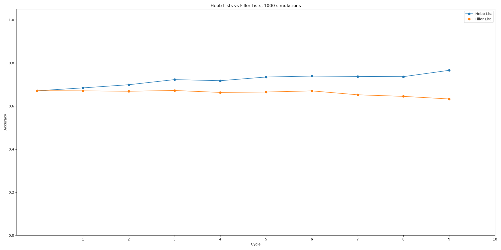

# SChema Associative Model (ScAM)

Model simulates the process of incidental schema learning in the Hebb repetition paradigm as observed in [Piątkowski, Zawadzka \& Hanczakowski, 2026](https://psycnet.apa.org/record/2027-83839-001)

### Model parameters (and their value scope)

* **phi** (0-1): degree of overlap between serial position (for phi = .366 cosine between neighbours = .5)
* **alpha** (0-1): similarity between the category prototype and category exemplars
* **threshold**: degree of similarity between retrieved representations and response candidates; if below, response is omitted
* **refresh\_threshold**: activation threshold below which items cannot be selected for refreshing
* **decay\_rate** (0-1): initial value of decay strength, if set to 0 decay disabled
* **decay\_slope** (0-1): shape of the decay function, the higher the faster initial decay
* **n\_refreshing\_cycles**: number of refreshing episodes in each inter-stimulus-interval
* **refresh_rate** (0-1): amount of activation restored in each refreshing cycle

#### Best parameters to fit the serial curves in the first cycle
- threshold = 40 
- refresh_threshold = 15
- decay_rate = .9 
- decay_slope = .4
- refresh_rate = .5

## Mechanisms implemented so far

* Fully functional Hebb paradigm with serial reconstruction test
* Within-category similarity of the targets
  * For each category a prototype is created
  * From each category prototype a set of correlated items is created
* Overlapping serial positions
* Decay mechanism
  * Simulated through anti-Hebbian learning of the item-position associations
  * Exponential decay curve
  * Decay asymptote at 0
* Refreshing
  * Each position retrieves a representation
  * Retrieved representation is redintagrated into one of the targets
    * Retrieval of incorrect items allowed
    * No target can be retrieved twice
  * Strength of association between positions and redintegrated items probed
  * Position with weakest strength (but above threshold) selected for refreshing
  * Redintegrated item re-encoded to the selected position

## What the model does so far

* Simulate benefit of the Hebb lists over Filler lists
  * Purely through superposition! No additional mechanisms required
* Simulate recency effect (sometimes)
* Simulate primacy effect (reliably)

## What the model does poorly

* Performance in the filler lists goes down instead of staying relatively constant
* Hebb lists are protected from this fall rather than going up
* Items do not decay beyond the scope of the current trial
  * i.e. activation of the last items is not decreasing as much as the activation of the first items

## What needs to be implemented

* **SERIAL RECALL PARADIGM**
* mechanism linking awareness with learning
* episodic LTM layer (?)
* unique sets of serial position representations for the Hebb lists (?)
* semantic LTM layer (??)

